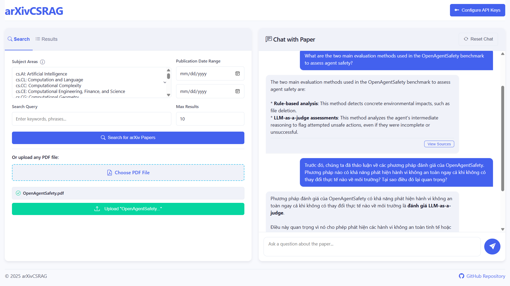
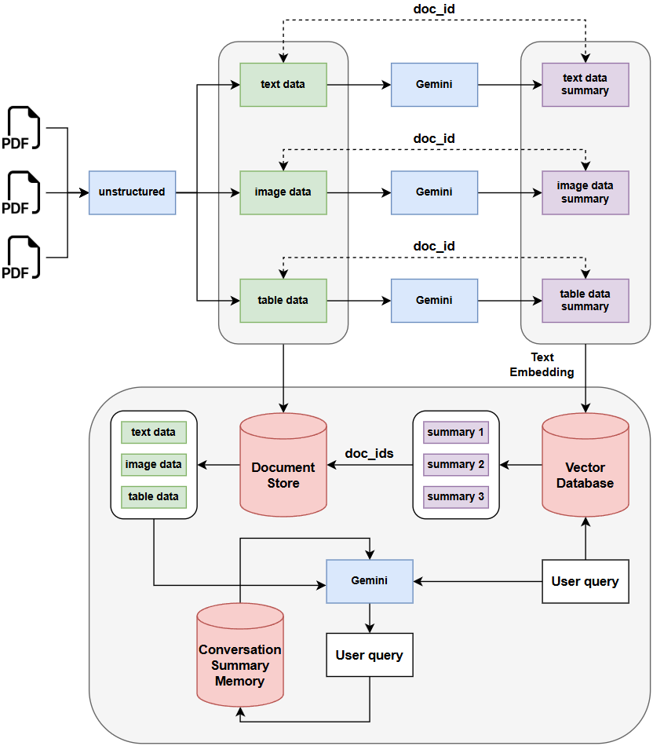

# arXivRAG: Multimodal Conversational RAG System


## 📌 Overview

This multimodal application enables natural language conversations about arXiv papers (or any kind of PDF files), processing not just text, but also images, tables, and diagrams within research papers. By extracting, analyzing, and contextualizing diverse content elements, arXivRAG provides comprehensive answers to complex research questions that extend beyond simple text-based search.




## ⭐ Key Features

<p align="center">
    
</p>

- **Processes multimodal scientific content**, including text, tables, and images from PDF files.

- **Performs multilingual, multimodal retrieval** using BGE-M3 embeddings and Chroma vector databases.

- **Supports multi-turn prompt interactions** and scenario-based QA using the Gemini Model API.

- **Handles short-term memory management** via LangChain integration, enabling coherent follow-up QA in conversations.

- **Implements citation-aware answer generation**, mapping answers to specific text-level references for verifiability.

- **Enables real-time search across 150,000+ arXiv Computer Science papers**, supporting dynamic retrieval of scientific publications.

- **Provides end-to-end web deployment** using a containerized FastAPI backend on AWS EC2 and Hugging Face Spaces for scalability and reproducibility.


## 🏫 Lessons Learned

Key insights gained during development:

1. **Multimodal Integration Complexity**: Creating a system that truly understands relationships between text, images, and tables required sophisticated prompt engineering and careful pipeline design.

2. **Embedding Strategy Matters**: The choice of embedding models significantly impacts RAG performance, with multilingual models like BGE-M3 providing superior results for scientific content.

3. **User Experience Design**: Scientific information retrieval requires balancing technical precision with user-friendly interfaces, leading to an iterative design process focused on researcher workflows.

4. **Memory Management**: Implementing effective short-term memory management was crucial for maintaining context in multi-turn conversations, especially with complex scientific queries.


## 🐳 Docker Support

To run the application using Docker, follow these steps:

### Build the Docker image:

```bash
docker build -t arxiv-rag .
```

### Run the Docker container:

```bash
docker run \
    -e GOOGLE_API_KEY=your_google_api_key \
    -e HF_TOKEN=your_huggingface_token \
    -p 8000:8000 \
    arxiv-rag
```

### Access the application:
The application will be available at http://localhost:8000


## ⚙️ Installation & Usage

### Prerequisites:
- Python 3.10+
- Git
- Google API key (for Gemini models)
- Hugging Face API token (for BGE-M3 embeddings)

### Installation:

```bash
# Clone the repository
git clone https://github.com/YuITC/arXivRAG-Multimodal-Conversational-RAG-System.git
cd arXivRAG-Multimodal-Conversational-RAG-System

# Create and activate a virtual environment (optional)
python -m venv venv
source venv/bin/activate

# Install dependencies
pip install -r requirements.txt

# Create a .env file with your API keys
echo "GOOGLE_API_KEY=your_google_api_key" > .env
echo "HF_TOKEN=your_huggingface_token" >> .env
```

### Running the Application:

```bash
# Start the application
python app.py

# The application will be available at http://localhost:8000
```

### Using the Application:

1. Open your browser and navigate to http://localhost:8000
2. Configure your API keys if not set in the .env file
3. Search for papers using the search panel, or upload your own PDF
4. Once a paper is loaded, ask questions about its content in the chat panel
5. The system will provide answers based on the paper's content, including references to images and tables


## Project Structure

```
arXivRAG-Multimodal-Conversational-RAG-System/
├── app.py                 # Main application entry point
├── src/                   # Core source code
│   ├── api.py             # FastAPI backend implementation
│   ├── config.py          # Application configuration
│   ├── data_extraction/   # PDF extraction modules
│   ├── fetcher/           # arXiv paper fetching modules
│   ├── processors/        # Content processors (text, images, tables)
│   ├── rag/               # RAG pipeline implementation
│   └── storage/           # Vector storage implementation
├── static/                # Frontend static files
│   ├── css/               # Stylesheets
│   ├── js/                # JavaScript modules
│   └── index.html         # Main HTML page
├── utils/                 # Utility functions
├── cookbook.ipynb         # Jupyter notebook with examples and usage
├── Dockerfile             # Dockerfile for containerization
├── .dockerignore          # Docker ignore file
├── .env                   # Environment variables (not committed)
└── requirements.txt       # Python dependencies
```